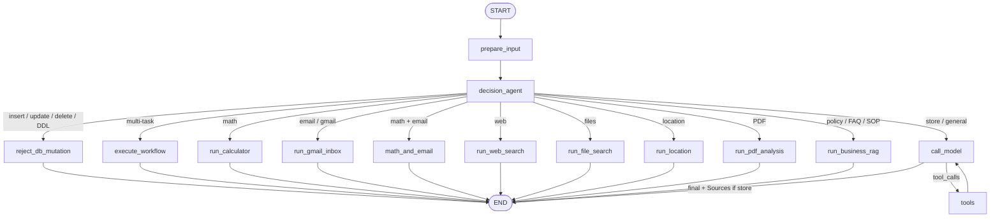

# Andromeda Agent — Workflow

How **Andromeda / Solar** decides, executes, grounds, cites, and **refuses unsafe DB mutations** — written for operators and engineers who need a production-grade mental model.

Companion to [README.md](./README.md). RAG design note: [prototypeRAG.md](./prototypeRAG.md). Read-only security: [SecurityReadOnly.md](./SecurityReadOnly.md). Implementation: `src/agent/graph.py`, `src/agent/custom_tools/db_safety_agent.py`, `src/agent/custom_tools/sql_readonly_validator.py`, `src/agent/custom_tools/database_tools.py`, `src/agent/custom_tools/business_rag_tools.py`, `src/agent/embeddings.py`.

---

## 1. Operating model

Treat the agent as a **router with tools**, not a chatbot that occasionally calls APIs.

| Phase | Responsibility | Failure mode to avoid |
|-------|----------------|------------------------|
| **Classify** | One route per fresh user turn | Letting every message fall into an unbounded tool loop |
| **Guard** | Block insert / update / delete / DDL before tools | Crashing on bad SQL or silently mutating Neon |
| **Execute** | Dedicated node or bounded `call_model ⇄ tools` | Soft-binding tools that Groq cannot force reliably |
| **Ground** | Answers come from tool/DB output only | Model-invented products, policies, or numbers |
| **Cite** | Append **Sources** in code after DB answers | Asking the LLM to “remember” citations |

**Invariant:** structured commerce facts → Neon SQL (read-only). Policy / FAQ / SOP knowledge → Neon document RAG. Mutations never go through this agent.

---

## 2. High-level architecture

```text
┌──────────────┐    ┌─────────────────────┐    ┌──────────────────────────────────┐
│ User         │───▶│ React / Streamlit / │───▶│ LangGraph StateGraph (graph.py)  │
│ natural lang │    │ LangGraph Studio    │    │ prepare → decide → execute       │
└──────────────┘    └─────────────────────┘    └────────────────┬─────────────────┘
                                                                │
   ┌────────────────────┬───────────────────┬───────────────────┼────────────────┐
   ▼                    ▼                   ▼                   ▼                ▼
┌────────────┐   ┌──────────────┐   ┌──────────────┐   ┌──────────────┐  ┌──────────────┐
│ Read-Only  │   │ Store SQL    │   │ Business RAG │   │ Dedicated    │  │ call_model   │
│ Guard      │   │ SELECT only  │   │ trust layer  │   │ nodes        │  │ ⇄ tools      │
│ keywords→  │   │ + Sources    │   │ + Sources    │   │ calc, gmail… │  └──────────────┘
│ bulletin + │   └──────────────┘   └──────────────┘   └──────────────┘
│ LLM decide │
│ refuse I/U │
│ /D/DDL     │
└────────────┘
```

**Stack**

| Layer | Technology |
|-------|------------|
| Orchestration | LangGraph `StateGraph` |
| LLM | Groq `llama-3.1-8b-instant` via `ChatGroq` |
| Store DB | Neon Postgres (`psycopg`), read-only `query_store_database` |
| Read-Only Guard | Keyword suspicion bulletin → Groq READ/WRITE (`db_safety_agent.py`) → `reject_db_mutation` |
| Store SQL | Explicit READ SQL writer + sqlglot AST + structured JSON tool results |
| Business RAG | Hybrid BM25 / keywords / **BGE** + top-5 trust layer (`business_rag_tools.py`) |
| UI | Vite/React dashboard + Streamlit |
| API / Studio | `langgraph dev` |

---

## 3. Graph topology

### Mermaid



### Nodes

| Node | Role |
|------|------|
| `prepare_input` | Normalize `user_input` / `messages` |
| `decision_agent` | Set `agent_route` + `task_plan_summary`; runs Read-Only Guard |
| `reject_db_mutation` | Refuse DB mutations — joke + formal block; UI warning, no crash |
| `execute_workflow` | Multi-step planned pipeline |
| `run_calculator` | SymPy / calculator tools |
| `run_email` / `run_gmail_inbox` | Gmail OAuth inbox automation |
| `math_and_email` | Calculate then inbox action |
| `run_web_search` | DuckDuckGo when enabled |
| `run_file_search` | Local filesystem search |
| `run_location` | OSM reverse geocode + nearby |
| `run_pdf_analysis` | Uploaded PDF summarize / Q&A |
| `run_business_rag` | Top-5 hybrid retrieve → trust read → answer → all Sources |
| `run_store_database` | Explicit store synthesis path (Studio visibility) |
| `call_model` | Groq chat; soft-binds store tool when needed |
| `tools` | ToolNode execution; loops to `call_model` |

### State (selected fields)

| Field | Purpose |
|-------|---------|
| `messages` | Conversation + tool traces |
| `user_input` | Studio / UI entry when messages empty |
| `web_search_enabled` | Gate for live web search |
| `task_plan_summary` | Human-readable plan for UI / Studio |
| `agent_route` | Chosen branch name |
| `db_guard_blocked` | True when Read-Only Guard refused the turn |
| `db_guard_layer` | `rules` / `ai` / `rules+ai` |
| `db_guard_detail` | Short guard summary for pipeline UI |
| `user_latitude` / `user_longitude` | Browser geolocation |
| `pdf_data_base64` / `pdf_filename` | Uploaded PDF payload |

---

## 4. Decision order (fresh turn only)

On a **new human message**, `decision_agent` evaluates in this order:

1. **Read-Only Guard** (keywords → suspicion bulletin → LLM decide; unambiguous SQL hard-block) — if blocked → `reject_db_mutation`
2. Multi-task plan → `execute_workflow`
3. Gmail inbox / reply intent → `run_gmail_inbox`
4. Location / nearby → `run_location`
5. Business knowledge keywords → `run_business_rag`
6. Store commerce keywords → `call_model` (SQL tool path)
7. Math ± email → calculator nodes
8. Web / files → dedicated nodes when applicable
9. Fallback → `call_model`

Mid-turn tool returns always go back to `call_model` (not a new classify).

---

## 5. Workflow 0 — Read-Only Guard (security)

**Goal:** No user prompt, jailbreak, or LLM hallucination can execute (or falsely report) a database write. Keyword matches are **not wasted** — they raise LLM scrutiny instead of auto-blocking every hit.

```text
1. Rules keyword/pattern scan (forbidden mutation scope)
     a) Unambiguous SQL DML/DDL (UPDATE … SET, DELETE FROM, DROP, …)
        → hard-block immediately (layer=rules)
     b) Soft keyword hit (e.g. "update", "correct", "sync")
        → do NOT auto-block; attach [RULES SUSPICION BULLETIN — elevated scrutiny]
          to the classifier prompt (matched_signal, mutation_kind, hard_rule, reason)
2. Semantic READ vs WRITE (Groq), informed by the bulletin when present
     WRITE thresholds: ~0.35 confidence if keywords hit, else ~0.40
     READ allow: needs ≥ ~0.55 confidence if keywords hit, else ≥ ~0.45
     Keyword hit + weak/ambiguous READ → fail closed (rules_elevated_weak_read)
     Clear READ despite keywords ("if you cannot update, list products") → allow
3. If WRITE → reject_db_mutation (skip SQL generator + SQL tool)
     Refusal UX: fresh 2-line joke ("😄 Solar says:") then formal block message
4. If READ SQL is produced → sqlglot AST validator (mandatory, independent of LLM)
5. Tool returns JSON {success, rows, row_count} or {success:false, error}
6. Assistant answers ONLY from tool output; never fabricates success
7. Prefer DATABASE_READONLY_URL (SELECT-only role)
8. Audit log: prompt, intent, SQL, validator, tool status, final response
9. Frontend: warning panel + 🛡️ Read-Only Guard
```

**Hard-blocked examples**

| Kind | Examples |
|------|----------|
| Insert | `INSERT INTO products …`, “add a product to neon” |
| Update | `UPDATE products SET …`, “correct the customer's address”, “mark order #10 as paid” |
| Delete | `DELETE FROM customers`, “purge all products”, “cancel order #12” |
| DDL | `DROP TABLE`, `ALTER TABLE`, `TRUNCATE`, `CREATE TABLE` |
| Ops | “import this CSV”, “restore yesterday's backup”, “synchronize the records” |

**Still allowed**

- Read: “Which products are low in stock?”
- Advice / policy: “I want to replace a product, what should I do?”
- Read after refusal wording: “okay if you cannot update, list products” (keyword elevates scrutiny; LLM allows clear READ)

**Code:** `db_safety_agent.py` (`_rules_suspicion_bulletin`, `evaluate_read_only_guard`, `generate_readonly_guard_joke`), `sql_readonly_validator.py`, `db_audit_log.py`, `database_tools.py`  
**Unit:** `tests/unit_tests/test_db_safety_agent.py`, `test_db_readonly_security_regression.py`, `test_sql_readonly_validator.py`  
**Integration:** `tests/integration_tests/test_db_safety_guard_llm.py`

```bash
# Rules-only portion (no LLM required)
uv run pytest tests/integration_tests/test_db_safety_guard_llm.py -k rules_ -v

# Unit: suspicion bulletin + allow clear READ despite "update"
uv run pytest tests/unit_tests/test_db_safety_agent.py -v

# Full live LLM + graph path (optional)
uv run pytest tests/integration_tests/test_db_safety_guard_llm.py -v
```

---

## 6. Workflow A — Solar Store SQL

**Goal:** Answer inventory, sales, and customer questions with live Neon rows — never with memorized catalog fiction. The model is an explicit **READ SQL query writer** only.

```text
1. Guard already passed (intent = READ; WRITE never reaches this path)
2. Intent: needs_store_database(user_text)
3. Refresh: solar_store_schema.sql ← information_schema on Neon
     Schema banner: QUERY WRITER POLICY — SELECT / WITH … SELECT only
4. Soft-bind: query_store_database only (do not force Groq tool_choice)
5. SQL_GENERATOR_SYSTEM: emit ONE read statement
     ALLOWED: SELECT / WITH … SELECT (+ JOIN, aggregates, LIMIT)
     FORBIDDEN: UPDATE/INSERT/DELETE/DDL/txn/admin
     Change-asks → REFUSE_WRITE (no SQL)
6. If prose instead of tool_call → synthesize tool_call from extracted SELECT
7. ToolNode → query_store_database:
     a) sqlglot AST validator (mandatory; independent of LLM)
     b) prefer DATABASE_READONLY_URL + session read_only
     c) return JSON {success, rows, row_count} or {success:false, error}
8. After success (or MAX_TOOL_ROUNDS): force final answer, no more tools
9. Grounding: answer ONLY from tool JSON; never invent rows or claim writes
10. Code appends Sources: database, tables, row count, SQL
11. Audit log (agent.db_security): prompt, intent, SQL, validator, tool, response
```

**Operator checks**

- Tool message is JSON with `"success": true` (or false + error) — not a fabricated UPDATE success
- Final answer names only appear in `rows` / `table_text`
- Footer contains `Sources:` and a fenced SQL block that is SELECT-only

**Seed**

```bash
python scripts/seed_store_database.py
python scripts/export_store_schema.py
```

**Try (READ)**

- Which products are low in stock?
- Total revenue by store
- Show orders for Ayesha Khan
- Top selling products

**Must refuse (WRITE — Path 0)**

- Correct the customer's address.
- Mark order #10 as paid.
- Import this CSV into the database.

---

## 7. Workflow B — Business knowledge RAG (trust layer)

**Goal:** Answer “how do we handle X?” from curated docs. Retrieve with **keywords + BGE**, then force the model to **read each of the top 5 sources** before answering so citations are trustworthy.

```text
1. Intent: needs_business_rag(user_text)
2. Node: run_business_rag  (graph.py)
3. Hybrid retrieve TOP_K=5 over business_chunks ⨝ business_documents
     BM25 + phrase/title/tag keywords + BGE (BAAI/bge-small-en-v1.5)
     Embeddings: src/agent/embeddings.py → models/bge-small-en-v1.5
4. Trust pass 1: LLM reads EACH of [1]…[5] → RELEVANT / NOT_RELEVANT + exact quotes
5. Trust pass 2: answer ONLY from RELEVANT quotes; cite [1], [2], …
6. Response body:
     Answer
     ---
     Source analysis (trust layer) — used: [n] titles…
     Sources (top 5 retrieved) — every passage listed (USED vs reviewed)
```

**Operator checks**

- Footer lists all top-5 titles (USED / reviewed), not a silent subset
- Source analysis shows which indexes were RELEVANT
- Conflicting claims without retrieved support must say context is insufficient

**Seed**

```bash
python scripts/download_embedding_model.py
python scripts/seed_business_rag.py
```

**Try**

- What is our return and refund policy?
- How do I get my money back for an unopened accessory?
- How long is the warranty on earbuds?
- What are Friday store hours?
- What is the gift card and store credit policy?

---

## 8. Workflow C — Bounded tool chat

For PDF generation, calculator fallbacks, and general tools:

- Bind the appropriate tool set.
- Cap store-related tool rounds (`MAX_TOOL_ROUNDS_PER_TURN = 2`).
- Prefer dedicated nodes when classification is cheap and reliable (math, Gmail, location, RAG, **guard**).

---

## 9. Sources contract

| Path | Footer includes |
|------|-----------------|
| Store SQL | `neondb`, `query_store_database`, tables, rows, SELECT SQL (from tool JSON) |
| Business RAG | `business_documents` / `business_chunks`, all top-5 titles, types, scores, USED/reviewed + trust analysis |
| Read-Only Guard | Mutation kind + layer (`rules` / `ai` / `rules+ai`); refusal includes joke + formal block — not a data Sources block |

Sources / guard footers are appended in code (`ensure_store_sources_footer`, `format_rag_sources`, `db_mutation_block_message`).

---

## 10. Tool map

| Concern | Module | Entry points |
|---------|--------|--------------|
| Read-Only Guard | `db_safety_agent.py`, `db_audit_log.py` | `evaluate_read_only_guard`, `_rules_suspicion_bulletin`, `generate_readonly_guard_joke`, `reject_db_mutation` |
| SQL AST gate | `sql_readonly_validator.py` | `validate_readonly_sql_ast` |
| Store SQL | `database_tools.py` | `SQL_GENERATOR_SYSTEM`, `query_store_database`, schema refresh |
| Business RAG | `business_rag_tools.py` + `embeddings.py` | `answer_business_rag_sync` (top-5 + 2-pass), `business_knowledge_rag` |
| Math | `calculator_tools.py` | `casio_calculator`, batch solve |
| Gmail | `gmail_inbox_tools.py` | unread read / reply / process |
| Web | `web_search_tools.py` | DuckDuckGo |
| Files | `file_search_tools.py` | local search |
| Location | `location_tools.py` | Nominatim / Overpass |
| PDF out | `pdf_generator.py` | text / table reports |
| PDF in | `pdf_analysis.py` | summarize / ask |

---

## 11. Failure playbook

| Symptom | Likely cause | Fix |
|---------|--------------|-----|
| Invented products | Store answer without successful tool rows | Confirm tool message; check soft-bind + synthesize path |
| Groq `Failed to call a function` | Forced `tool_choice` | Keep soft bind; synthesize tool_call from SQL text |
| Empty RAG | Unseeded `business_*` tables | `python scripts/seed_business_rag.py` |
| Schema mismatch | Stale `solar_store_schema.sql` | `export_store_schema.py` or store turn refresh |
| Connection failed | Missing `PGPASSWORD` / `DATABASE_URL` | Fix `.env`; pooler for app, unpooled for seed |
| Mutation ask crashed | Old server without guard | Restart LangGraph; expect `reject_db_mutation` |
| Harmful intent allowed | Guard phrase gap or weak LLM | Add pattern; extend `test_db_safety_guard_llm.py`; keywords still elevate bulletin |
| False block on “list products” | Keyword alone treated as WRITE | Expect suspicion bulletin + LLM allow; see `test_ai_allows_read_when_update_word_but_list_products` |
| Missing Sources | Old server process | Restart LangGraph after pull |

---

## 12. Example state payloads

**Blocked mutation**

```json
{
  "user_input": "DELETE FROM customers"
}
```

Expected: `agent_route=reject_db_mutation`, `db_guard_blocked=true`. Refusal text starts with `😄 Solar says:` (2-line joke) then the formal block.

**Clear READ despite keyword “update”**

```json
{
  "user_input": "okay if you can not update could you please provide me list of product"
}
```

Expected: not blocked; route continues to store READ SQL (keywords elevate scrutiny; LLM allows).

**Store question**

```json
{
  "user_input": "Which products are low in stock?",
  "web_search_enabled": false
}
```

**Business RAG**

```json
{
  "user_input": "What is our return and refund policy?"
}
```

---

## 13. Mental checklist before shipping a change

1. Does this intent get a **dedicated route**, or does it need the tool loop?
2. Is the source of truth **SQL**, **documents**, or **neither**?
3. Would insert / update / delete / DDL be **guarded** before tools (bulletin + LLM; hard SQL block)?
4. Will the final message still get **Sources** if the model forgets?
5. Did you keep Groq tool binding **soft** for named store tools?
6. Did you seed Neon and refresh schema after schema changes?
7. Did you extend the harmful-intent integration list when adding new mutate phrases?

If those answers are clear, the workflow is production-shaped.
