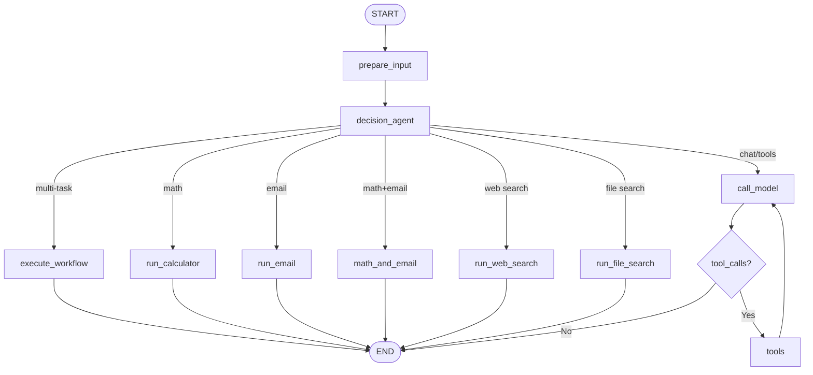
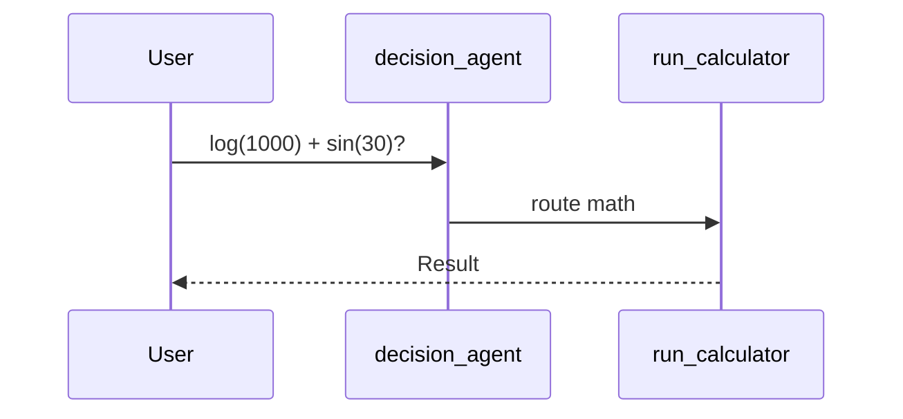

# Andromeda Agent — Workflow

This document explains how the **Andromeda Agent** works: graph structure, tool routing, and common end-to-end flows.

---

## 1. High-level architecture

```
┌─────────────┐     ┌──────────────────┐     ┌─────────────────────────────┐
│   User      │────▶│  Streamlit UI    │────▶│  LangGraph (graph.py)       │
│  (chat)     │     │  streamlit_ui.py │     │  decision_agent → nodes     │
└─────────────┘     └──────────────────┘     └──────────────┬──────────────┘
                                                            │
              ┌─────────────────────────────────────────────┼──────────────────────────┐
              │                                             │                          │
              ▼                                             ▼                          ▼
     ┌─────────────────┐                         ┌──────────────────┐       ┌──────────────────┐
     │ Dedicated nodes │                         │ call_model       │       │ custom_tools/    │
     │ calculator      │                         │ + tools loop     │       │ calculator,      │
     │ web search      │                         │ (PDF, email)     │       │ web, file, PDF,  │
     │ file search     │                         └──────────────────┘       │ email            │
     └─────────────────┘                                                    └──────────────────┘
```

**Stack**

| Layer | Technology |
|-------|------------|
| Orchestration | LangGraph `StateGraph` |
| LLM | Groq `llama-3.1-8b-instant` via `ChatGroq` |
| Tools | LangChain `@tool` + `langchain_community` (DuckDuckGo) |
| UI | Streamlit (`streamlit_ui.py`) |
| API / Studio | LangGraph Server (`langgraph dev`) |

---

## 2. LangGraph node flow

The graph has **10 explicit nodes** visible in LangGraph Studio.

### Graph nodes

| Node | Role | Tool / action |
|------|------|---------------|
| `prepare_input` | Normalize `user_input` / `messages` | — |
| `decision_agent` | Plan tasks, set `task_plan_summary` & `agent_route` | `task_planner.py` |
| `execute_workflow` | Multi-step pipeline | intro → math → PDF → email |
| `run_calculator` | Direct math path | `casio_calculator` / batch |
| `run_email` | Email prior results | Gmail SMTP |
| `math_and_email` | Calculate then email | calculator + SMTP |
| `run_web_search` | Web search (user must enable 🔍) | DuckDuckGo via LangChain |
| `run_file_search` | Local file search | `search_files` |
| `call_model` | LLM for general chat | Groq + tool binding |
| `tools` | Execute LLM-selected tools | PDF, email, calculator fallback |

### Mermaid diagram



### Decision agent routing order

On each fresh user turn, `decision_agent` picks **one** branch:

1. **Multi-task** → `execute_workflow` (intro + math + PDF + email, etc.)
2. **Math + email** → `math_and_email`
3. **Math only** → `run_calculator`
4. **Email only** → `run_email`
5. **Web search** → `run_web_search` (only if user enabled 🔍 **and** query needs live web info)
6. **File search** → `run_file_search` (find/list local files)
7. **Fallback** → `call_model` → `tools` loop

### State

| Field | Purpose |
|-------|---------|
| `messages` | Full chat history |
| `user_input` | Required input (Studio / UI) |
| `web_search_enabled` | User toggle from Streamlit 🔍 |
| `task_plan_summary` | Plan shown in Studio state |
| `agent_route` | Chosen branch name |

**Input example:**

```json
{
  "user_input": "Search the web for Python best practices",
  "web_search_enabled": true
}
```

---

## 3. Tool routing logic

### Dedicated nodes (decision agent)

These tools run **directly** without going through the LLM tool loop:

| Tool | Graph node | Trigger |
|------|------------|---------|
| `casio_calculator` | `run_calculator` | Math expressions detected |
| `web_search` (DuckDuckGo) | `run_web_search` | 🔍 on + `needs_web_search()` |
| `search_files` | `run_file_search` | `needs_file_search()` |
| Workflow pipeline | `execute_workflow` | 2+ tasks in one message |

### LLM tool loop (`call_model` → `tools`)

Used for general conversation and when no dedicated route matches:

| Tool | Purpose |
|------|---------|
| `casio_calculator` / `solve_math_batch_tool` | Calculator fallback |
| `generate_pdf_report` | Text → PDF |
| `generate_table_report` | Table → PDF |
| `send_email` | Gmail SMTP |

---

## 4. Example workflows

### A. Math question

```
User: "What is log(1000) + sin(30)?"
  │
  ▼
decision_agent → is_math_query → run_calculator
  │
  ▼
END: "log(1000) + sin(30) = 3.5"
```



---

### B. File search

```
User: "Find all CSV files in current directory"
  │
  ▼
decision_agent → needs_file_search → run_file_search
  │
  ▼
search_files(query, path=".")
  │
  ▼
END: List of matching files
```

---

### C. Web search

```
User enables 🔍 in Streamlit, then: "Search the web for Python best practices"
  │
  ▼
decision_agent → web_search_enabled + needs_web_search → run_web_search
  │
  ▼
DuckDuckGo via langchain_community (no API key)
  │
  ▼
END: Formatted search results
```

---

### D. Multi-task exam workflow

```
User: "Introduce yourself, calculate these 11 expressions, create a PDF, email me"
  │
  ▼
decision_agent → execute_workflow
  │
  ▼
intro → calculate_math → create_pdf → send_email (with PDF attached)
  │
  ▼
END
```

---

## 5. File map

```
andromeda/
├── README.md
├── AgentWorkflow.md          ← This file
├── LICENSE
├── docs/
│   ├── GITHUB_SETUP.md
│   └── PROJECT_STRUCTURE.md
├── setup.sh / start.sh
├── streamlit_ui.py
├── langgraph.json
├── .env.example
│
└── src/agent/
    ├── graph.py              ← LangGraph nodes and edges
    ├── task_planner.py       ← Decision agent planning
    ├── routing.py            ← Intent detection + fallbacks
    ├── workflow_executor.py  ← Multi-step pipeline
    └── custom_tools/
        ├── calculator_tools.py
        ├── web_search_tools.py   ← DuckDuckGo (LangChain)
        ├── file_search_tools.py
        ├── email_tools.py
        └── pdf_generator.py
```

---

## 6. Where to run the agent

```bash
./start.sh ui        # Streamlit — http://localhost:8501
./start.sh server    # LangGraph Studio — http://127.0.0.1:2024
./start.sh both      # Both services
./start.sh stop      # Stop services
```

First-time setup:

```bash
cp .env.example .env
chmod +x setup.sh start.sh
./setup.sh
```

---

## 7. Environment variables

| Variable | Required | Purpose |
|----------|----------|---------|
| `GROQ_API_KEY` | Yes | Groq LLM API |
| `GMAIL_SMTP_USER` | For email | Sender Gmail address |
| `GMAIL_APP_PASSWORD` | For email | Gmail app password |
| `GMAIL_DEFAULT_RECIPIENT` | For email | Default To address |
| `LANGSMITH_API_KEY` | Optional | LangSmith tracing |

Web search uses **DuckDuckGo** through LangChain — no Google API or Programmable Search Engine needed.

---

## 8. Quick command reference

```bash
uv run pytest tests/unit_tests/ -v
uv run python -c "from agent import graph; print(list(graph.get_graph().nodes.keys()))"
./start.sh ui
```

---

## 9. Extending the workflow

### Add a tool to the LLM loop

1. Create `src/agent/custom_tools/your_tool.py` with `@tool`.
2. Append to `llm_tools` in `graph.py`.
3. Update `SYSTEM_PROMPT`.

### Add a dedicated graph node (recommended for clear routing)

1. Create the tool in `custom_tools/`.
2. Add intent detection in `task_planner.py` or `routing.py`.
3. Add `run_your_tool` node and route in `_pick_route()`.
4. Wire edges in `graph_builder`.
5. Add tests and update this document.

See [docs/PROJECT_STRUCTURE.md](./docs/PROJECT_STRUCTURE.md) for the full layout.

---

## 10. Publish to GitHub

See [docs/GITHUB_SETUP.md](./docs/GITHUB_SETUP.md). Suggested repo name: **`andromeda-agent`**.
