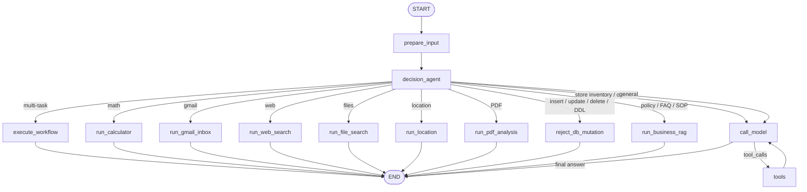

# Andromeda Agent

**A multi-tool LangGraph assistant powered by Groq, Neon Postgres, Gmail, web/file tools, PDF analysis, and browser-based UIs.**

Andromeda (branded **Solar** in chat) is an intelligent workflow agent that routes natural-language requests to the right capability: scientific calculation, web search, local file search, live location lookup, PDF generation, uploaded-PDF analysis, Gmail inbox automation, **live store SQL over Neon**, **business-knowledge RAG**, and general conversation.

Every answer that comes from the database ends with an explicit **Sources** block — tables, document titles, and the SQL that was run — so operators can trust and audit the result.

| | |
|---|---|
| **Author** | Muhammad Qasim Shabbir |
| **Email** | [muhammadqasimshabbir3@gmail.com](mailto:muhammadqasimshabbir3@gmail.com) |
| **Version** | 0.1.0 |
| **License** | MIT |

---

## What Andromeda Does

Andromeda is built for real multi-step workflows. A **decision agent** inspects each user turn once, picks a single execution path, and keeps tool↔model loops short. Structured store questions become live `SELECT`s on Neon. Policy / FAQ / SOP questions retrieve semi-structured business documents with **hybrid IR** (BM25 + phrase/field keywords + **BGE** embeddings), then a **trust layer** reads the **top 5** sources before answering with citations.

### Core Capabilities

| Capability | Description |
|------------|-------------|
| **Scientific calculator** | Logs, natural log, trig in degree mode, powers, factorials, complex numbers, and batch expression solving |
| **Web search** | DuckDuckGo/DDGS search through LangChain community tools; no separate search API key required |
| **File search** | Find files by name, extension, directory, or pattern |
| **PDF reports** | Generate styled text and table reports with ReportLab |
| **PDF analysis** | Upload PDFs, extract text with `pypdf`, build an in-memory Chroma index, summarize, and answer PDF-grounded questions |
| **Gmail inbox automation** | OAuth Gmail API flow to read unread messages, generate replies with Groq or Ollama, reply in-thread, and mark messages as read |
| **Live location** | Browser coordinates plus OpenStreetMap Nominatim/Overpass lookups for address and nearby places |
| **Solar Store SQL (Neon)** | Explicit **READ SQL** query writer (`SELECT` / `WITH … SELECT` only) + sqlglot AST gate + structured tool JSON + **Sources** |
| **Business knowledge RAG** | Semi-structured policies / FAQs / SOPs; hybrid BM25+BGE → **top 5** → trust-layer read → grounded answer + all **Sources** |
| **Read-Only Guard** | Keywords elevate LLM scrutiny (suspicion bulletin); semantic READ/WRITE decides; AST + optional SELECT-only role; humorous UI refusal |
| **Conversation memory** | Streamlit and React flows send message history/state so follow-up requests can reference prior answers |
| **Multi-task routing** | Plan and execute multi-step requests such as calculate → generate PDF → email/process inbox |
| **LangGraph Studio** | Visual debugging through `langgraph dev` |
| **UIs** | Streamlit chat UI and a Vite/React dashboard frontend |

---

## Tech Stack

| Layer | Technology |
|-------|------------|
| Orchestration | LangGraph `StateGraph` |
| LLM | Groq through `langchain-groq` (`llama-3.1-8b-instant`) |
| Tools | LangChain `@tool` decorators |
| Database | Neon PostgreSQL via `psycopg` (pooler for queries; unpooled for seed/DDL) |
| Store Q&A | Explicit READ SQL writer (`SQL_GENERATOR_SYSTEM`) + `query_store_database` + sqlglot AST |
| Business RAG | `business_documents` / `business_chunks` + hybrid BM25 / keywords / **BGE** (`models/bge-small-en-v1.5`) + top-5 trust layer |
| Read-Only Guard | Keyword suspicion bulletin → LLM READ/WRITE + AST + `DATABASE_READONLY_URL` |
| Web search | `langchain-community`, `duckduckgo-search`, `ddgs` |
| Math | SymPy |
| PDF generation | ReportLab |
| PDF analysis | `pypdf` + in-memory ChromaDB |
| Gmail | Gmail API OAuth client libraries; legacy SMTP helper still exists in `email_tools.py` |
| Location | OpenStreetMap Nominatim + Overpass API |
| Python UI | Streamlit |
| Frontend UI | React 19 + Vite + TypeScript + LangGraph SDK |
| Package manager | `uv` |
| Deployment | Docker/LangGraph API, Railway config, Vercel frontend config |

---

## Agent Workflow

This is how Andromeda is meant to behave in production: **classify once, execute once, ground always, cite always.**

### Design principles

1. **Route before you reason.** Fresh user turns hit `decision_agent` first. Dedicated intents (math, Gmail, location, PDF, business RAG) skip the general tool loop so latency and tool thrash stay low.
2. **Separate facts from prose.** Live inventory and orders come from Neon SQL. Policies and SOPs come from document retrieval. The model never invents either class of data.
3. **Read-only by default.** Any insert / update / delete / DDL intent is stopped by the **Read-Only Guard** (keyword suspicion bulletin + LLM) before tools run.
4. **Short tool loops.** Store questions bind `query_store_database` softly (Groq does not tolerate forced `tool_choice` reliably). After a successful query — or two tool rounds — the graph forces a final grounded answer.
5. **Provenance is mandatory.** Every database-backed reply appends a **Sources** footer in code (not left to the LLM): Neon target, tables or document titles, row counts, and SQL where applicable.
6. **Schema is a living contract.** Store SQL is generated against `solar_store_schema.sql`, refreshed from Neon before store turns so the model’s `SELECT` matches reality.

### End-to-end graph

```text
User (React / Streamlit / Studio)
  │
  ▼
prepare_input
  │
  ▼
decision_agent  ──► one route per turn
  │
  ├── execute_workflow          multi-step planned pipeline
  ├── run_calculator            math only
  ├── run_email / run_gmail_inbox
  ├── math_and_email
  ├── run_web_search
  ├── run_file_search
  ├── run_location
  ├── run_pdf_analysis
  ├── run_business_rag          policy / FAQ / SOP / warranty  → Neon docs + RAG + Sources
  ├── reject_db_mutation        Read-Only Guard (WRITE) → joke + refuse; no SQL
  ├── run_store_database        legacy / explicit store node
  └── call_model ⇄ tools        general chat + store SQL tool loop → Sources
```



### Routing priority (fresh user turn)

| Priority | Intent signal | Route | Grounding |
|----------|---------------|-------|-----------|
| 0 | Insert / update / delete / DDL / wipe / mutate Neon data | `reject_db_mutation` | **Read-Only Guard** (bulletin + LLM; joke + refuse) — no crash |
| 1 | Multi-task plan | `execute_workflow` | Per planned step |
| 2 | Gmail inbox / reply | `run_gmail_inbox` | Live Gmail API |
| 3 | Location / nearby | `run_location` | OSM + browser coords |
| 4 | Policy, warranty, FAQ, SOP, “what is our…” | `run_business_rag` | Neon `business_*` + trust-layer RAG |
| 5 | Stock, products, orders, revenue, customers | READ SQL writer → `query_store_database` | Neon + AST + JSON tool + SQL Sources |
| 6 | Math (+ optional email) | calculator nodes | SymPy |
| 7 | Web / files / PDF / chat | dedicated or `call_model` | Tool outputs |

### Path 0 — Read-Only Guard (security)

Neon is **read-only** for this agent. Defense in depth (not prompt-only):

```text
User: "Correct the customer's address." / "UPDATE …" / "DELETE …"
  → 1) Rules keyword/pattern scan (forbidden mutation scope)
       • Unambiguous SQL DML/DDL (e.g. "UPDATE … SET") → hard-block immediately
       • Soft keyword hits (e.g. word "update") → do NOT auto-block;
         attach [RULES SUSPICION BULLETIN] so the LLM knows malicious
         probability is higher, then decide READ vs WRITE
  → 2) Semantic READ/WRITE intent (Groq), with elevated thresholds when
       keywords matched (WRITE easier to block; weak READ fail-closed)
       WRITE → reject_db_mutation (no SQL generation, no SQL tool)
       Clear READ despite keywords (e.g. "if you cannot update, list products") → allow
  → 3) If a SELECT is generated: sqlglot AST validator (mandatory)
  → 4) Tool returns structured JSON {success, rows|error} — sole source of truth
  → 5) Prefer DATABASE_READONLY_URL (SELECT-only DB role)
  → Audit log: prompt, intent, SQL, validator, tool status, final response
  → Refusal UX: fresh 2-line joke ("😄 Solar says:") then formal block message
```

**How keywords are used:** they are not wasted and not the sole blocker (except clear SQL). A match injects a **suspicion bulletin** into the classifier prompt and raises scrutiny (WRITE block from confidence ~0.35; READ allow needs ≥ ~0.55 when keywords hit; weak/ambiguous READ + keyword hit → fail closed).

**Blocked:** correcting/editing records, sync/reconcile, mark paid/cancel orders, import/restore, plus classic INSERT/UPDATE/DELETE/DDL — regardless of wording or jailbreak.

**Still allowed:** read questions (“low in stock?”), policy advice (“replace a product, what should I do?”), and read-after-refusal phrasing (“if you cannot update, list products”).

Frontend pipeline step: **🛡️ Read-Only Guard**. Unit: `tests/unit_tests/test_db_safety_agent.py`, `test_db_readonly_security_regression.py`.

### Path A — Solar Store SQL (structured)

The LLM acts as an explicit **SQL QUERY WRITER** whose only job is **read SQL**.

```text
User: "Which products are low in stock?"
  → decision_agent: semantic intent must be READ (WRITE → Path 0)
  → refresh solar_store_schema.sql (includes QUERY WRITER POLICY banner)
  → call_model / synthesizer: SQL_GENERATOR_SYSTEM
       ALLOWED: one SELECT or WITH … SELECT
       FORBIDDEN: UPDATE/INSERT/DELETE/DDL/… ; change-asks → REFUSE_WRITE
  → tools: query_store_database(sql)
       1) sqlglot AST validator (mandatory)
       2) execute with DATABASE_READONLY_URL when set
       3) return JSON {success, rows, row_count} or {success:false, error}
  → call_model: answer ONLY from tool JSON (never invent rows / never claim writes)
  → Sources appended: Neon · tables · row count · SQL
```

Guarantees:

- Query writer prompt + schema banner: **READ SQL only** (`SQL_GENERATOR_SYSTEM`).
- SQL must pass the **sqlglot AST** validator; intent keywords inform the guard LLM (suspicion bulletin), they do not replace AST.
- Tool output is structured JSON — the assistant must not invent execution results.
- Prefer `DATABASE_READONLY_URL` (SELECT-only role) so the DB rejects writes if app checks fail.
- Row lists are capped (`LIMIT`) so answers stay bounded.
- Hallucinated SKUs that never appeared in the tool result are rejected by the grounding prompt; **Sources** still show what was actually queried.

### Path B — Business knowledge RAG (semi-structured)

```text
User: "What is our return and refund policy?"
  → decision_agent → run_business_rag
  → hybrid retrieve over business_chunks (TOP_K = 5)
       BM25 + phrase/title/tag keywords + BGE semantic (BAAI/bge-small-en-v1.5)
  → Trust layer pass 1: LLM reads EACH of the top 5 → RELEVANT / NOT_RELEVANT + quotes
  → Trust layer pass 2: answer ONLY from RELEVANT quotes, cite [1], [2], …
  → Response includes:
       Answer
       Source analysis (trust layer) — which docs were used
       Sources (top 5 retrieved) — all passages listed (USED vs reviewed)
```

One-page design note for reviewers: [prototypeRAG.md](./prototypeRAG.md).

Seed / refresh the corpus (re-run after changing the embedder):

```bash
python scripts/download_embedding_model.py   # once — saves to models/bge-small-en-v1.5
python scripts/seed_business_rag.py
python scripts/seed_store_database.py
python scripts/export_store_schema.py
```

### Path C — Everything else

Calculator, Gmail, web, files, location, and PDF analysis keep dedicated nodes. General chat uses `call_model` with a broader tool set. Multi-task plans run through `execute_workflow` without forcing every sub-step through the same tool loop.

### Graph nodes (current)

| Node | Purpose |
|------|---------|
| `prepare_input` | Normalize `user_input` or existing `messages` into graph messages |
| `decision_agent` | Choose an execution route and summarize the task plan |
| `execute_workflow` | Run multi-step planned workflows |
| `run_calculator` | Direct calculator path for math-only requests |
| `run_email` | Maps email intent to the Gmail inbox flow |
| `run_gmail_inbox` | Process unread Gmail messages through OAuth + Groq/Ollama |
| `math_and_email` | Calculate first, then run the Gmail inbox action |
| `run_web_search` | Run web search when the web toggle/state allows it |
| `run_file_search` | Search local files |
| `run_location` | Reverse-geocode browser coordinates and find nearby places |
| `run_pdf_analysis` | Summarize or answer questions against an uploaded PDF |
| `run_business_rag` | Hybrid top-5 retrieve + trust-layer read + grounded answer + all Sources |
| `reject_db_mutation` | Read-Only Guard refusal (joke + formal block); no SQL path |
| `run_store_database` | Explicit store path (READ SQL synthesis / Studio visibility) |
| `call_model` | General Groq chat; store READ SQL soft-bound when needed |
| `tools` | Execute model-selected tools (AST-gated `query_store_database`) |

More flow detail lives in [AgentWorkflow.md](./AgentWorkflow.md).

---

## Repository Layout

```text
.
├── README.md
├── AgentWorkflow.md
├── prototypeRAG.md
├── .env.example
├── Dockerfile
├── langgraph.json
├── pyproject.toml
├── setup.sh
├── start.sh
├── streamlit_ui.py
├── railway.json
├── vercel.json
├── models/
│   └── README.md                 # BGE download instructions (weights gitignored)
├── frontend/
│   ├── package.json
│   ├── vite.config.ts
│   └── src/
├── scripts/
│   ├── services.sh
│   ├── download_embedding_model.py
│   ├── seed_store_database.py
│   ├── seed_business_rag.py
│   ├── export_store_schema.py
│   └── sql/
├── src/
│   ├── gmail_agent.py
│   └── agent/
│       ├── graph.py
│       ├── routing.py
│       ├── embeddings.py           # BGE load / embed_query / embed_documents
│       ├── task_planner.py
│       ├── workflow_executor.py
│       ├── pdf_analysis.py
│       ├── data/
│       │   └── solar_store_schema.sql
│       └── custom_tools/
│           ├── calculator_tools.py
│           ├── database_tools.py       # SQL_GENERATOR_SYSTEM + query_store_database
│           ├── sql_readonly_validator.py
│           ├── db_audit_log.py
│           ├── business_rag_tools.py
│           ├── db_safety_agent.py
│           ├── email_tools.py
│           ├── file_search_tools.py
│           ├── gmail_inbox_tools.py
│           ├── location_tools.py
│           ├── pdf_generator.py
│           └── web_search_tools.py
└── tests/
    ├── unit_tests/
    └── integration_tests/
```

---

## Prerequisites

- Python 3.11 or 3.12
- `uv`
- Groq API key for the main agent
- Node.js and npm for the React frontend
- Neon Postgres project (for store SQL + business RAG)
- Gmail OAuth Desktop credentials if you want Gmail inbox automation
- Ollama only if you want local fallback replies for Gmail automation

Web search does not need a separate API key. Location lookup uses public OpenStreetMap services and can be customized with `OSM_USER_AGENT`.

---

## Environment Variables

Copy the example file and fill in your keys before running `setup.sh` or `start.sh`:

```bash
cp .env.example .env
```

See [`.env.example`](./.env.example) for the full list. Key variables:

| Variable | Required | Purpose |
|----------|----------|---------|
| `GROQ_API_KEY` | Yes | Groq LLM API |
| `GROQ_MODEL` | No | Groq model name |
| `DATABASE_URL` / `PG*` | For store + RAG | Neon connection (pooler URL + `PGPASSWORD`) |
| `DATABASE_READONLY_URL` | Recommended for store tools | SELECT-only role URL (preferred by `query_store_database`) |
| `PGUSER_READONLY` / `PGPASSWORD_READONLY` | Optional | Discrete read-only role if full URL unset |
| `PGHOST_UNPOOLED` | For seed/DDL | Direct Neon host for migrations and seed scripts |
| `LANGSMITH_API_KEY` | No | LangSmith tracing / auth |
| `GOOGLE_CLIENT_SECRETS` | For Gmail inbox | Path to OAuth client JSON |
| `GMAIL_TOKEN_FILE` | For Gmail inbox | Cached OAuth token path |
| `OLLAMA_URL` / `OLLAMA_MODEL` | No | Local fallback for Gmail replies |
| `GMAIL_SMTP_USER` / `GMAIL_APP_PASSWORD` | For SMTP | Legacy outbound email helper |
| `OSM_USER_AGENT` | No | OpenStreetMap identity string |
| `LOG_LEVEL` | No | Logging level (default `INFO`) |

### Frontend Environment

For the React frontend, copy [frontend/.env.example](./frontend/.env.example) to `frontend/.env` if you need custom values.

| Variable | Default | Purpose |
|----------|---------|---------|
| `VITE_LANGGRAPH_API_URL` | `/api` | LangGraph API URL or Vite/Vercel proxy path |
| `VITE_LANGGRAPH_ASSISTANT_ID` | `agent` | Must match `langgraph.json` graph key |
| `VITE_LANGSMITH_API_KEY` | empty | Optional key for authenticated deployments |
| `VITE_DEFAULT_USER_INPUT` | calculator example | Default form input |
| `VITE_DEFAULT_WEB_SEARCH` | `false` | Default search toggle value |

---

## Installation

```bash
git clone https://github.com/YOUR_USERNAME/andromeda-agent.git
cd andromeda-agent

# Create and edit .env first.
cp .env.example .env
nano .env

chmod +x setup.sh start.sh
./setup.sh
```

If you prefer manual installation:

```bash
uv venv .venv
uv sync
```

### Seed Neon (store + business RAG)

After Neon credentials are in `.env`:

```bash
# Structured Solar Store tables + sample commerce data
uv run python scripts/seed_store_database.py

# Semi-structured policies / FAQs / SOPs + BGE chunk embeddings
uv run python scripts/download_embedding_model.py   # once
uv run python scripts/seed_business_rag.py

# Refresh on-disk schema used for SQL generation
uv run python scripts/export_store_schema.py
```

---

## Running The Project

### Modern Web UI (Vite / React)

```bash
./start.sh both
```

Open **`http://localhost:5173`** — this is the modern Andromeda console (prompt, pipeline, results).

For UI only (LangGraph already running):

```bash
./start.sh ui
```

### Legacy Streamlit UI

```bash
./start.sh streamlit
```

Open `http://localhost:8501`.

CORS for local UIs (Streamlit `8501`, Vite `5173`, LangGraph Studio) is set in [`langgraph.json`](./langgraph.json) and via `CORS_ALLOW_ORIGINS` in `.env`.

### LangGraph Server And Studio

```bash
./start.sh server
```

By default `start.sh server` runs `langgraph dev` on port `2024` with a tunnel for LangGraph Studio.

```bash
uv run langgraph dev --port 2024
```

### React Frontend

```bash
cd frontend
npm install
npm run dev
```

Open `http://localhost:5173`.

---

## Gmail OAuth Inbox Automation

This project can read unread Gmail messages, draft replies with Groq or Ollama, send replies in the same thread, and mark messages as read.

Setup:

1. Enable the Gmail API in Google Cloud Console.
2. Create an OAuth Client ID with application type `Desktop app`.
3. Download the JSON credentials file.
4. Set `GOOGLE_CLIENT_SECRETS` in `.env` to that JSON file path.
5. Set `GMAIL_TOKEN_FILE` to where the OAuth token should be cached.
6. Run the agent once to complete browser consent.

```bash
uv run python src/gmail_agent.py
uv run python src/gmail_agent.py --limit 5
```

Keep OAuth secrets and token files out of version control.

---

## Example Prompts

| Prompt | Expected route |
|--------|----------------|
| `What is log(1000) + sin(30)?` | `run_calculator` |
| `Find all CSV files in current directory` | `run_file_search` |
| `Search the web for Python best practices` | `run_web_search` when web search is enabled |
| `Where am I?` | `run_location` when coordinates are available |
| `Find nearby restaurants` | `run_location` |
| `Summarize this uploaded PDF` | `run_pdf_analysis` when PDF data is provided |
| `Process my unread Gmail inbox messages` | `run_gmail_inbox` |
| `DELETE FROM customers` | `reject_db_mutation` (Read-Only Guard) |
| `UPDATE products SET price = 1` | `reject_db_mutation` |
| `DROP TABLE orders` | `reject_db_mutation` |
| `Correct the customer's address.` | `reject_db_mutation` (semantic WRITE) |
| `Mark order #10 as paid.` | `reject_db_mutation` |
| `Import this CSV into the database.` | `reject_db_mutation` |
| `Please update anything in the database` | `reject_db_mutation` |
| `If you cannot update, list products` | READ SQL (keywords elevate scrutiny; LLM allows clear READ) |
| `Which products are low in stock?` | READ SQL writer → `query_store_database` + **Sources** |
| `Total revenue by store` | READ SQL + **Sources** |
| `What is our return and refund policy?` | `run_business_rag` + trust layer + **Sources** |
| `How long is the warranty on earbuds?` | `run_business_rag` + **Sources** |
| `What are Friday store hours?` | `run_business_rag` + **Sources** |
| `Generate a PDF report about AI` | `call_model` → `tools` |
| `Introduce yourself, calculate these expressions, create a PDF report` | `execute_workflow` |

---

## Development

```bash
# Unit tests
uv run pytest tests/unit_tests/ -v

# Integration tests (live Groq / optional Neon — needs GROQ_API_KEY)
uv run pytest tests/integration_tests/ -v
uv run pytest tests/integration_tests/test_db_safety_guard_llm.py -v

# All tests
uv run pytest

# Verify graph imports
uv run python -c "from agent import graph; print(list(graph.get_graph().nodes.keys()))"

# Lint
uv run ruff check src tests

# React build
cd frontend
npm run build
```

Expected graph nodes:

```text
prepare_input, decision_agent, execute_workflow, run_calculator,
run_email, run_gmail_inbox, math_and_email, run_web_search, run_file_search,
run_location, run_pdf_analysis, run_business_rag, reject_db_mutation,
run_store_database, call_model, tools
```

Read-Only Guard integration coverage lives in
`tests/integration_tests/test_db_safety_guard_llm.py` — a comprehensive harmful-intent
list (insert / update / delete / DDL) verified with rules and optional live Groq calls.
---

## Deployment Notes

- [langgraph.json](./langgraph.json) registers the graph as `agent` and configures permissive CORS for local, Studio, and deployed frontend use.
- [Dockerfile](./Dockerfile) is based on `langchain/langgraph-api:3.12` and exposes the LangGraph API service.
- [railway.json](./railway.json) configures Railway to build from the Dockerfile.
- [vercel.json](./vercel.json) builds the React frontend from `frontend/` and serves the Vite output.
- The frontend defaults to `/api`; add a rewrite/proxy to your backend if deploying separately.
- Seed Neon as part of environment bring-up; app containers should use the **pooler** `DATABASE_URL`.

---

## Security Notes

- Do not commit `.env`, Gmail OAuth client secrets, Gmail token files, app passwords, or Neon credentials.
- **Defense in depth for Neon:**
  1. Rules keyword/pattern scan → unambiguous SQL hard-block; soft hits inject **RULES SUSPICION BULLETIN** (elevated LLM scrutiny, not auto-block)
  2. Semantic READ/WRITE intent (`db_safety_agent.py`) with stricter confidence when keywords matched → WRITE never reaches SQL generation
  3. Explicit **READ SQL query writer** (`SQL_GENERATOR_SYSTEM` + schema QUERY WRITER POLICY)
  4. Mandatory **sqlglot AST** validator (`sql_readonly_validator.py`)
  5. Structured tool JSON as sole source of truth (no fabricated write success)
  6. Prefer `DATABASE_READONLY_URL` (SELECT-only DB role)
  7. Audit log via `db_audit_log.py` (`agent.db_security`)
- Blocked mutations show a humorous refusal (`😄 Solar says:`) plus a formal warning — the run does not crash.
- Use a Gmail App Password only for the legacy SMTP helper.
- Use Gmail OAuth for inbox reading and in-thread replies.
- OpenStreetMap services are public; set a meaningful `OSM_USER_AGENT` for production use.
- Uploaded PDF indexes are in-memory and process-local.

---

## License

This project is licensed under the **MIT License**. See [LICENSE](./LICENSE).
